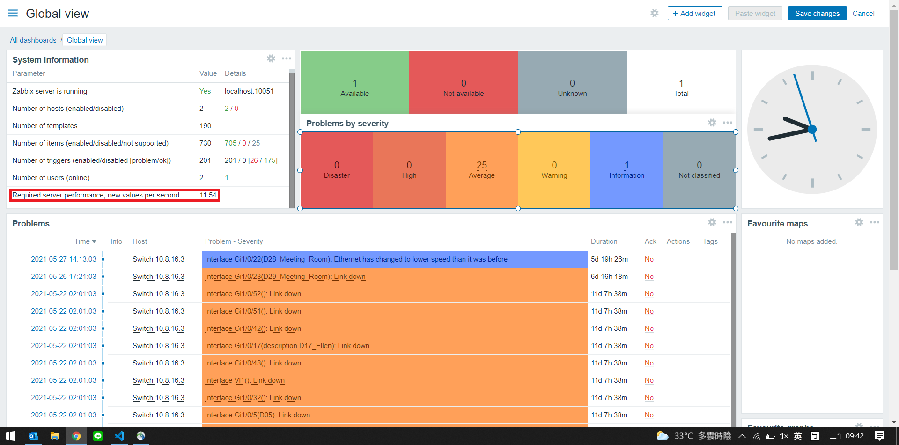

# 安裝與佈署

[TOC]

## 3.1 安裝環境概述

&emsp;&emsp;Zabbix-Server 運行環境為 Linux(UNIX) + PHP + Database，PHP 可以與 Nginx or Apache 組合使用，Database 可以選擇 MySQL、Oracle、PostgrSQL。本章節由 CentOS 8 (64 位)、httpd、PHP 和 MariaDB 組成。

### 3.1.1 硬體環境需求

&emsp;&emsp;**1. 硬體配置需求**
&emsp;&emsp;對於最小化安裝環境，官方推薦的硬體配置如下。

| 環境 | 平台 | CPU/MEM | 資料庫 | 硬體 | 監控主機數 |
| :---- | :---- | :---- | :---- | :---- | :---- |
| 小型 | CentOS | 2 Core/1GB  | MySQL、InnoDB | 普通 | 100 |
| 中型 | CentOS | 2 Core/2GB  | MySQL、InnoDB | 普通 | 500 |
| 大型 | Red Hat Enterprise Linux | 4 Core/8GB | MySQL、InnoDB、PostgreSQL | RAID 10 SAS or SSD | > 1000 |
| 超大型 | Red Hat Enterprise Linux | 8 Core/16GB | MySQL、InnoDB、PostgreSQL | RAID 10 SAS or SSD | > 10000 |

&emsp;&emsp;對於具體的需求，與**監控的機器數量和數據量**，關係密切，一般來說，硬碟 I/O 出現的瓶頸的概率大一些。選用物理服務器，性能會較好。對於中大型環境來說，建議採用物理機來搭建監控環境，硬碟選用 SAS/SSD/PCIE SSD。如果是 SAS 硬碟，建議做 RAID 10，以保證其讀/寫性能和物理安全。不論搭建環境是在物理、虛擬機或是雲，在整個 Zabbix 監控系統搭建中，**硬碟 I/O 性能、資料庫性能**是系統良好運行的重要因素。

&emsp;&emsp;**2. 硬碟空間要求**
&emsp;&emsp;Zabbix-Server 所需的硬碟空間取決於監控數據的更新頻率、每次更新頻率的數據大小、監控數存儲歷史週期、監控數據刪除策略以及資料庫本身日誌大小等。衡量資料庫寫入的一個關鍵指標是 NVPS (New Values Per Second)。




&emsp;&emsp;&emsp;&emsp;(1) 歷史數據所需空間大小

&emsp;&emsp;&emsp;&emsp;NVPS 值所指每秒處理的平均數據量，通過這個值可以計算出資料庫所需的空間大小。例如**每筆數據占用 50 B 的存儲空間，因此 NVPS x 每筆數據的平均大小 = 歷史數據所需空間大小**。歷史數據所需空間大小的計算公式如下：

> 歷史數據所需的空間大小 = 天數 x 每秒處理的數據量 x 1 天 x 24 小時 x 1 小時 3600s x 50 B

&emsp;&emsp;&emsp;&emsp;例如有 60000 個監控項，監控指標數據更新週期為 60s，每秒需要處理的數據量為 60000 / 60 = 1000 條，歷史數據保留 90 天，計算如下：

> (90 x 24 x 3600) x 1000 x 50 = 388800000000 (B), 約 362 GB

&emsp;&emsp;&emsp;&emsp;(2) 趨勢數據所需空間大小

&emsp;&emsp;&emsp;&emsp;按照統計抽樣得出結論，在 MySQL 中每一個監控項的趨勢數據約為 **128 B**。趨勢數據所需的空間大小如下：

> 趨勢數據所需空間大小 = 監控項 x 每天 24 小時 x 一年 365 天 x 128 B

&emsp;&emsp;&emsp;&emsp;假設有 60000 監控項，保存一年的趨勢數據，其需要的空間大小如下：

> 60000 x 24 x 365 x 128 = 67276800000 (B)，約為 67 GB

&emsp;&emsp;&emsp;&emsp;(3) 事件數據所需空間大小

&emsp;&emsp;&emsp;&emsp;每個事件都占用 130 B 空間，假設保存事件數據一年，則需要的空間大小如下：

> 1 x 24 x 365 x 130 = 4099680000 (B)，約為 4 GB

&emsp;&emsp;&emsp;&emsp;因此，60000 個監控項，更新數據週期為 60s，歷史數據保留 90 天，趨勢數據保留一年，總共需要的空件大小為：

> 362 + 67 + 4 = 433 (GB)

&emsp;&emsp;&emsp;&emsp;在真實生產環境中所需的硬碟空間會更多，因為資料庫本身有日誌文件，每個監控項數據的大小與理論值也有偏差，因此硬碟空間可能會超過 500 GB，故須提供的硬碟空間大小要大於 500 GB。

&emsp;&emsp;&emsp;&emsp;(4) 計算公式總結

&emsp;&emsp;&emsp;&emsp;硬碟空間計算方法如下表：

| 選項 | 所需的硬碟空間 (單位 B) |
| :---- | :---- |
| Zabbix 配置數據 | 約 10 MB，取決於監控主機的規模 |
| 歷史數據 | **days x (items/refresh) x 24 x 3600 x bytes** |
| 趨勢數據 | **days x (items/3600) x 24 x 3600 x bytes** |
| 事件數據 | **days x events x 24 x 3600 x bytes** |
| 所需硬碟總空間 | 配置數據空間 + 歷史數據空間 + 趨勢數據空間 + 事件數據空間 |

### 3.1.2 軟體環境需求

&emsp;&emsp;**1. 操作系統版本需求**
&emsp;&emsp;&emsp;&emsp;由於 Zabbix 核心組件由 C 語言撰寫，所以理論上可支持 Linux、UNIX、Windows 等作業系統。但 Zabbix-Server 和 Zabbix-Proxy 不支持 Windows 系統 (底層依賴 UNIX 特性)。

| 系統發行版 | Zabbix-Server | Zabbix-Proxy | Zabbix-Agent |
| :---- | :---- | :---- | :---- |
| AIX | 支持 | 支持 | 支持 |
| FreeBSD | 支持 | 支持 | 支持 |
| HP-UX | 支持 | 支持 | 支持 |
| Linux | 支持 | 支持 | 支持 |
| Mac OS X | 支持 | 支持 | 支持 |
| Novell Netware | 不支持 | 不支持 | 支持 |
| Open BSD | 支持 | 支持 | 支持 |
| SCO Open Server | 支持 | 支持 | 支持 |
| Solaris | 支持 | 支持 | 支持 |
| Tru64/OSF | 支持 | 支持 | 支持 |
| Windows | 不支持 | 不支持 | 支持 |

&emsp;&emsp;**2. 資料庫版本需求**

| 資料庫 | 版本 | 備註 |
| :---- | :---- | :---- |
| MySQL | >= 5.6 | 需要支持 InnoDB 存儲引擎 |
| Oracle | >= 10g |
| PostgreSQL | >= 8.1 | 建議使用 8.3，有較好性能 |
| SQLite | >= 3.3.5 | 僅支持 Zabbix-Proxy |
| IBM DB2 | >= 9.7 |

&emsp;&emsp;**3. Zabbix-Web 所需軟體環境**

| 軟體 | 版本 | 備註 |
| :---- | :---- | :---- |
| Apache | >= 1.3.12 |
| PHP | >= 5.4.0 | Zabbix 3.0 需要 5.4 以上版本 |
| **以下為 PHP 擴展支持** |
| gd | >= 2.0 | PHP GD 擴展需要支持 PNG、JPEG 和 FreeType2 |
| bcmath | | php-bcmath |
| ctype | | php-ctype |
| libXML | >= 2.6.15 | php-xml or php5-dom |
| xmlreader | | php-xmlreader |
| Xmlwriter | | php-xmlwriter |
| session | | php-session |
| sockets | | php-net-socket |
| mbstring | | php-mbstring |
| gettext | | php-gettext |
| ibm_db2 | | 使用 DB2 需要此支持 |
| mysqli | | 使用 MySQL 需要此支持 |
| oci8 | | 使用 Oracle 需要此參數 |
| pgsql | | 使用 PostgreSQL 需要此支持 |
| sqlite3 | | 使用 SQLite 需要此支持 |

&emsp;&emsp;**4. 支持的瀏覽器**

&emsp;&emsp;瀏覽器需要支持 Cookies、JavaScript。

&emsp;&emsp;**5. Zabbix-Server 軟體需求**

| 依賴軟體 | 說明 |
| :---- | :---- |
| libpcre | 支持正則表達式，選擇 PRCE v8.X 以上版本 |
| libevent | 支持 IPMI 監控 |
| libpthread | 支持互斥鎖和讀寫鎖 |
| OpenIPMI | 支持 IPMI |
| libssh2 | 如需要支持 SSH，則需要 libssh 1.0 及以上版本 |
| fping | 支持 ICMP Ping |
| libcurl | 支持 Web 監控、SMTP 認證功能，需要 7.20 及以上版本 |
| libiksemel | 支持 Jabber 告警方式 |
| net-snmp | 支持 SNMP |

&emsp;&emsp;**6. 時間同步需求**

&emsp;&emsp;Zabbix-Server 對時間的精準要求比較高，時間對數據的計算等都有影響，因此必須設置 Chrony 自動同步時間。

```bash
dnf install chrony

# 修改 /etc/chrony.conf 配置
# pool time.stdtime.gov.tw iburst

systemctl enable chronyd.service
systemctl start chronyd.service
```

&emsp;&emsp;**7. SELinux 配置**

&emsp;&emsp;關閉 SELinux。

```bash
 setenforce 0 && sed -i 's/^SELINUX=.*/SELINUX=permissive/g' /etc/selinux/config
```

### 3.1.3 網路環境需求

&emsp;&emsp;盡量將 Zabbix-Server 部署在核心機房，要求到各節點網路穩定。另外要考慮到網路流量、帶寬等問題。

## 3.2 Zabbix-Server 安裝

&emsp;&emsp;下面以 CentOS 8 (64 位元) 為例，也可以到 [Zabbix Download](https://www.zabbix.com/download?zabbix=5.0&os_distribution=centos&os_version=8&db=mysql&ws=apache) 依照不同平台選擇安裝。

### 3.2.1 選擇平台

| ZABBIX VERSION | OS DISTRIBUTION | OS VERSION | DATABASE | WEB SERVER |
| :------------: | :-------------: | :--------: | :------: | :--------: |
| 5.0 LTS        | CentOS          | 8          | MySQL    | Apache     |

### 3.2.2 安裝和配置 Zabbix-Server

#### a. 安裝 Zabbix repository

```bash
rpm -Uvh https://repo.zabbix.com/zabbix/5.0/rhel/8/x86_64/zabbix-release-5.0-1.el8.noarch.rpm
dnf clean all
```

#### b. 安裝 Zabbix server, frontend, agent

```bash
# 在 Zabbix-Server 上安裝 Zabbix-Agent，是為了通過 Agent 方式監控 Zabbix-Server 伺服器本身的運行狀況
dnf install zabbix-server-mysql zabbix-web-mysql zabbix-apache-conf zabbix-agent
```

#### c. 安裝和啟動 MySQL


```bash
dnf install mariadb-server
systemctl enable mariadb.service
systemctl start mariadb.service
```

#### d. 新增和初始化資料庫

```bash
mysql -uroot -p
# 建立名為 zabbix 的資料庫，並設置字元為 UTF-8
mysql> create database zabbix character set utf8 collate utf8_bin;
# 建立使用者 zabbix 以及密碼
mysql> create user zabbix@localhost identified by 'password';
# 設置 zabbix 資料庫的所有權限，允許用戶 zabbix 的 IP localhost 訪問
mysql> grant all privileges on zabbix.* to zabbix@localhost;
mysql> quit;
```

&emsp;&emsp;在 Zabbix-Server 主機上導入初始化模式和數據。

```bash
zcat /usr/share/doc/zabbix-server-mysql*/create.sql.gz | mysql -uzabbix -p zabbix
```

### 3.2.3 設置 Zabbix-Server 參數


&emsp;&emsp;編輯檔案 /etc/zabbix/zabbix_server.conf

```bash
DBPassword=password

# 以下部分為性能調教參數，需要根據實際情況進行調整
DBHost=127.0.0.1 # 需要修改
DBName=zabbix    # 默認
DBUser=zabbix    # 默認
DBPassword=zabbix # 需要修改
StartPollers=100 # 約 5 台服務器開一個進程，最大 1000
StartIPMIPollers=10 # 視 IPMI 監控主機個數而定
StartPollersUnreachable=10 # 不可達主機重試獲取數據進程個數
StartTrappers=10 # Trapper 進程個數
StartPingers=10 # Ping 進程個數
StartDiscoverers=10 # 自動發現進程個數
CacheSize=256M # 可根據實際情況修改
HistoryCacheSize=128M # 可根據實際情況修改
ValueCacheSize=128M # 可根據實際情況修改
Timeout=30 # 可根據實際情況修改
TrapperTimeout=300 # 此處需要修改，最大執行時長 (30s 以內)
```


#### a. 設置 PHP for Zabbix fronted

&emsp;&emsp;編輯檔案 /etc/php-fpm.d/zabbix.conf，取消以下註解並修改時區。

```bash
; php_value[date.timezone] = Asia/Taipei
```

#### b. 重啟 Zabbix server and agent processes

```
systemctl restart zabbix-server zabbix-agent httpd php-fpm
systemctl enable zabbix-server zabbix-agent httpd php-fpm
```

### 3.2.4. 防火牆和權限配置

&emsp;&emsp;(1) 防火牆配置

```bash
firewall-cmd --add-port=80/tcp --permanent
firewall-cmd --add-port=10050/tcp --permanent
firewall-cmd --add-port=10051/tcp --permanent
firewall-cmd --reload
```

&emsp;&emsp;(2) php.ini 配置文件的設置

&emsp;&emsp;編輯檔案 /etc/php.ini：

```bash
date.timezone = Asia/Taipei
```

&emsp;&emsp;重啟 httpd

```
systemctl restart httpd
```

### 3.2.5. 配置 Zabbix-Web

&emsp;&emsp;連線至: http://server_ip_or_name/zabbix。


&emsp;&emsp;PHP 檢查預安裝套件。


&emsp;&emsp;配置資料庫的各項參數，如果資料庫不在本地端，而是在其他台伺服器上，連線之前請確保 MySQL port 有打開，才可以連線。


&emsp;&emsp;**注意**，如果 Zabbix-Server 在其他台機器中，這裡的 Host 則需要修改為 Zabbix-Server 的 IP，並確保 port 有打開，從前端 PHP 連到 Zabbix-Server 端口為 10051。


&emsp;&emsp;配置完整訊息會被寫入 /etc/zabbix/conf/zabbix.conf.php 文件中。


&emsp;&emsp;配置成功。


&emsp;&emsp;Zabbix-Web 連接資料庫和 Zabbix-Server 端口的配置訊息如下。

```php
<?php
// Zabbix GUI configuration file.

$DB['TYPE']                     = 'MYSQL';
$DB['SERVER']                   = 'localhost';
$DB['PORT']                     = '0';
$DB['DATABASE']                 = 'zabbix';
$DB['USER']                     = 'zabbix';
$DB['PASSWORD']                 = 'password';

// Schema name. Used for PostgreSQL.
$DB['SCHEMA']                   = '';

// Used for TLS connection.
$DB['ENCRYPTION']               = false;
$DB['KEY_FILE']                 = '';
$DB['CERT_FILE']                = '';
$DB['CA_FILE']                  = '';
$DB['VERIFY_HOST']              = false;
$DB['CIPHER_LIST']              = '';

// Use IEEE754 compatible value range for 64-bit Numeric (float) history values.
// This option is enabled by default for new Zabbix installations.
// For upgraded installations, please read database upgrade notes before enabling this option.
$DB['DOUBLE_IEEE754']   = true;

$ZBX_SERVER                     = 'localhost';
$ZBX_SERVER_PORT                = '10051';
$ZBX_SERVER_NAME                = '';

$IMAGE_FORMAT_DEFAULT   = IMAGE_FORMAT_PNG;

// Uncomment this block only if you are using Elasticsearch.
// Elasticsearch url (can be string if same url is used for all types).
//$HISTORY['url'] = [
//      'uint' => 'http://localhost:9200',
//      'text' => 'http://localhost:9200'
//];
// Value types stored in Elasticsearch.
//$HISTORY['types'] = ['uint', 'text'];

// Used for SAML authentication.
// Uncomment to override the default paths to SP private key, SP and IdP X.509 certificates, and to set extra settings.
// $SSO['SP_KEY']                  = 'conf/certs/sp.key';
//$SSO['SP_CERT']                  = 'conf/certs/sp.crt';
//$SSO['IDP_CERT']                 = 'conf/certs/idp.crt';
//$SSO['SETTINGS']                 = [];
```

&emsp;&emsp;登入頁面，默認帳戶是 Admin，密碼為 zabbix。


&emsp;&emsp;登入後頁面。


&emsp;&emsp;(1) /etc/zabbix/zabbix_server.conf 中的參數。

```bash
DBHost=localhost    # 資料庫 IP，如果不是本機中，修改實際 IP
DBName=zabbix       # 資料庫名稱
DBUser=zabbix       # 資料庫用戶
DBPassword=password # 資料庫密碼
```

&emsp;&emsp;Zabbix 可在 Administration => Users => User name => Languages 修改語言。


&emsp;&emsp;開啟告警提示訊息和前端消息的聲音提示。


&emsp;&emsp;禁用 Guests 組，防止非授權登入用戶訪問。


### 3.2.6 相關故障處理

&emsp;&emsp;**第一種情況**：在其他參數 (iptables、SELinux) 配置正確情況下，如果 Web 介面提示 Zabbix-Server 無法連接成功的訊息，則進入 Zabbix-Server 系統透過 Telnet 測試。


&emsp;&emsp;假設 10.0.0.1 10051 端口是不通的，可以編輯檔案 /etc/zabbix/web/zabbix.conf.php，修改 $DB['SERVER']。

```php
<?php
// Zabbix GUI configuration file.

$DB['TYPE']                     = 'MYSQL';
$DB['SERVER']                   = 'localhost';
$DB['PORT']                     = '0';
$DB['DATABASE']                 = 'zabbix';
$DB['USER']                     = 'zabbix';
$DB['PASSWORD']                 = 'password';

// Schema name. Used for PostgreSQL.
$DB['SCHEMA']                   = '';

// Used for TLS connection.
$DB['ENCRYPTION']               = false;
$DB['KEY_FILE']                 = '';
$DB['CERT_FILE']                = '';
$DB['CA_FILE']                  = '';
$DB['VERIFY_HOST']              = false;
$DB['CIPHER_LIST']              = '';

// Use IEEE754 compatible value range for 64-bit Numeric (float) history values.
// This option is enabled by default for new Zabbix installations.
// For upgraded installations, please read database upgrade notes before enabling this option.
$DB['DOUBLE_IEEE754']   = true;

$ZBX_SERVER                     = 'localhost';
$ZBX_SERVER_PORT                = '10051';
$ZBX_SERVER_NAME                = '';
```

&emsp;&emsp;**第二種情況**：資料庫文件 mysql.sock 無法找到，提示訊息如下。

```bash
Database error: Error connecting to database [Can't connect to local MySQL server through socket /var/lib/mysql/mysql.sock]
```

&emsp;&emsp;錯誤原因是因為 PHP 無法透過 Socket 連接到 MySQL。

```bash
php -i | grep sock

# Response
mysqli.default_socket => /var/lib/mysql/mysql.sock => /var/lib/mysql/mysql.sock
pdo_mysql.default_socket => /var/lib/mysql/mysql.sock => /var/lib/mysql/mysql.sock
sockets
default_socket_timeout => 60 => 60
```

&emsp;&emsp;**注意**：在將 /etc/php.ini 修改 mysql.sock 的路徑後，須重啟 httpd 服務。

&emsp;&emsp;**第三種情況**：資料庫連接失敗。解決思路和方法：
&emsp;&emsp;(1) 檢查資料庫服務是否正常
&emsp;&emsp;(2) 檢查防火牆是否允許
&emsp;&emsp;(3) 檢查權限是否允許訪問
&emsp;&emsp;(4) 檢查連接 MySQL 是否出現問題

### 3.2.7 zabbix_server 程序的參數

&emsp;&emsp;zabbix_server 提供了一些操作指令。

```bash
usage:
  zabbix_server [-c config-file]
  zabbix_server [-c config-file] -R runtime-option
  zabbix_server -h
  zabbix_server -V

The core daemon of Zabbix software.

Options:
  -c --config config-file        Path to the configuration file
                                 (default: "/etc/zabbix/zabbix_server.conf")
  -f --foreground                Run Zabbix server in foreground
  -R --runtime-control runtime-option   Perform administrative functions

    Runtime control options:
      config_cache_reload        Reload configuration cache
      housekeeper_execute        Execute the housekeeper
      log_level_increase=target  Increase log level, affects all processes if
                                 target is not specified
      log_level_decrease=target  Decrease log level, affects all processes if
                                 target is not specified
      snmp_cache_reload          Reload SNMP cache
      diaginfo=section           Log internal diagnostic information of the
                                 section (historycache, preprocessing, alerting,
                                 lld, valuecache, locks) or everything if section is
                                 not specified

      Log level control targets:
        process-type             All processes of specified type
                                 (alerter, alert manager, configuration syncer,
                                 discoverer, escalator, history syncer,
                                 housekeeper, http poller, icmp pinger,
                                 ipmi manager, ipmi poller, java poller,
                                 poller, preprocessing manager,
                                 preprocessing worker, proxy poller,
                                 self-monitoring, snmp trapper, task manager,
                                 timer, trapper, unreachable poller,
                                 vmware collector)
        process-type,N           Process type and number (e.g., poller,3)
        pid                      Process identifier, up to 65535. For larger
                                 values specify target as "process-type,N"

  -h --help                      Display this help message
  -V --version                   Display version number

Some configuration parameter default locations:
  AlertScriptsPath               "/usr/share/zabbix/alertscripts"
  ExternalScripts                "/usr/share/zabbix/externalscripts"
  SSLCertLocation                "/usr/share/zabbix/ssl/certs"
  SSLKeyLocation                 "/usr/share/zabbix/ssl/keys"
  LoadModulePath                 "/usr/lib64/zabbix/modules"

Report bugs to: <https://support.zabbix.com>
Zabbix home page: <http://www.zabbix.com>
Documentation: <https://www.zabbix.com/documentation>
```

&emsp;&emsp;手動執行清理器 (Housekeeper)，可以刪除過期數據。

```bash
zabbix_server -R housekeeper_execute

# Response
zabbix_server [11830]: command sent successfully
```

&emsp;&emsp;在線執行重載配置緩存。

```bash
zabbix_server -R config_cache_reload

# Response
zabbix_server [11966]: command sent successfully
```

## 3.3 Zabbix-Agent 客戶端的安裝

### 3.3.1 安裝 Zabbix-Agent

&emsp;&emsp;Zabbix 客戶端的採集方式有 Agent、SNMP 等，在這裡我們學習如何安裝 Agent。

```bash
rpm -Uvh https://repo.zabbix.com/zabbix/5.0/rhel/8/x86_64/zabbix-release-5.0-1.el8.noarch.rpm
dnf clean all
dnf install zabbix-agent
```

### 3.3.2 防火牆設置

```bash
firewall-cmd --add-port=10050/tcp --permanent
firewall-cmd --reload
```

### 3.3.3 配置 zabbix_agentd.conf

&emsp;&emsp;編輯檔案 /etc/zabbix/zabbix_agentd.conf。

```bash
PidFile=/var/run/zabbix/zabbix_agentd.pid  # pid 文件路徑
LogFile=/var/log/zabbix/zabbix_agentd.log  # log 文件路徑
LogFileSize=0                              # log 切割大小，0 代表不切割
Server=127.0.0.1                           # 被動模式，Zabbix-Server 的 IP
ServerActive=127.0.0.1                     # 主動模式，Zabbix-Server 的 IP
Hostname=Zabbix server                     # 本機的 Hostname，使用主動模式必須配置
Include=/etc/zabbix/zabbix_agentd.d/*.conf # 包含子配置的文件
UnsafeUserParameters=1                     # 啟用特殊字串，用於自定義監控
```

* Server：被動模式，允許 zabbix-server 伺服器端連接客戶端，此處允許本機和 192.168.2.34 訪問 10050 端口，多個 IP 用逗號間隔。
* ServerActive：主動模式，向 zabbix-server 傳輸數據。這種模式性能較好，**但須確保 Hostname 與 Zabbix-Web 中的主機名一致**，否則會看到以下錯誤訊息。

```bash
4558:20170805:100253.544 cannot send list of active checks to "10.0.2.30" host [web-1] not found
```

&emsp;&emsp;配置完成後，啟用 Zabbix-Agent

```bash
systemctl enable zabbix-agent
systemctl start zabbix-agent
```

### 3.4 SNMP 監控配置

&emsp;&emsp;由於某些設備不能安裝 Zabbix-Agent，可以採用 SNMP 的方式來監控。

```bash
dnf install net-snmp
```

&emsp;&emsp;編輯檔案 /etc/snmp/snmpd.conf

```bash
com2sec mynetwork 192.168.0.240 public_monitor
com2sec mynetwork 127.0.0.1 public
group MyROGroup v2c mynetwork
access MyROGroup "" any noauth prefix all none none
view all included .1 80
```

```bash
systemctl enable snmpd
systemctl start snmpd
```

## 3.5 Windows 中安裝 Zabbix-Agent

### 3.5.1 安裝與配置

&emsp;&emsp;[Zabbix Agent Download](https://www.zabbix.com/download_agents?version=5.0+LTS&release=5.0.12&os=Windows&os_version=Any&hardware=amd64&encryption=OpenSSL&packaging=MSI&show_legacy=0)，找到相對應版本下載後，解壓縮後執行。

### 3.5.2 註冊服務

&emsp;&emsp;在 cmd 切換到 zabbix_agentd.exe 的路徑下，執行指令。

```bash
cmd>zabbix_agentd.exe --intstall -c "c\Progrm Files\zabbix_agents_5.0.12.win\conf\zabbix_agentd.win.conf"
```

&emsp;&emsp;在 windows 中開啟服務，點選 Zabbix Agent 右鍵啟動。

## 3.6 其他平台安裝 Zabbix-Agent

&emsp;&emsp;[Zabbix Agent Download](https://www.zabbix.com/download_agents?version=5.0+LTS&release=5.0.12&os=Windows&os_version=Any&hardware=amd64&encryption=OpenSSL&packaging=MSI&show_legacy=0)，找到相對應版本下載後，解壓縮後執行。

## 3.7 Zabbix-Get 使用

&emsp;&emsp;安裝 zabbix-get。

```bash
dnf install zabbix-get
```

&emsp;&emsp;其用法如下：

```bash
zabbix_get [-hV] -s <host name or IP> [-p <port>] [-I <IP address>] -k <key>
```

&emsp;&emsp;-s：遠端 Zabbix-Agent 的 IP or 主機名。
&emsp;&emsp;-p：遠端 Zabbix-Agent 的端口。
&emsp;&emsp;-I：本機的出口 IP，用於一台機器中有多個網卡的情況。
&emsp;&emsp;-k：獲取遠端 Zabbix-Agent 數據所使用的 key。

&emsp;&emsp;範例如下：

```bash
zabbix_get -s 127.0.0.1 -k system.uname

# Response
Linux zabbix 4.18.0-240.22.1.el8_3.x86_64 #1 SMP Thu Apr 8 19:01:30 UTC 2021 x86_64
```

## 3.8 Zabbix 相關術語 (指令)
&emsp;&emsp;**1. zabbix_server**
&emsp;&emsp;zabbix_server 是 Zabbix 伺服器端的核心程序。
&emsp;&emsp;**2. zabbix_proxy**
&emsp;&emsp;zabbix_proxy 是 Zabbix 代理服務的程序，用在分散式監控 Proxy 模式中。
&emsp;&emsp;**3. zabbix_agentd**
&emsp;&emsp;zabbix_agentd 是以獨立進程的方式來啟動的，其對應的配置文件為 zabbix_agentd.conf。
&emsp;&emsp;**4. zabbix_java_gateway**
&emsp;&emsp;這是 Zabbix 的 Java 採集伺服器端，用在 JMX 監控方式中。
&emsp;&emsp;**5. zabbix_sender**
&emsp;&emsp;這是 Zabbix 的 Trapping 模式，將採集到的數據透過定時任務主動發送給 zabbix_server。
&emsp;&emsp;**6. zabbix_get**
&emsp;&emsp;zabbix_get 是一個數據獲取測試命令，相當於 SNMP 中的 snmpwalk。

## 3.9 Zabbix-Server 對數據的存儲

&emsp;&emsp;無論監控系統採用何種架構，或是是否使用 Proxy，對於 Zabbix-Server 來說，數據存儲是一個非常大的挑戰。通常解決方法是分散式架構，並讓客戶端處於主動模式，會提高 Zabbix-Server 的性能。在這裡要介紹如何對 Zabbix-Server 端數據的存儲進行優化。這裡採用**表分區的方式**對資料庫進行優化，也可以透過分散式架構、Elasticsearch 搜索引擎資料庫來提高資料庫性能。

### 3.9.1 監控數據存儲

&emsp;&emsp;Zabbix-Server 將採集到的數據存儲在資料庫中，也了解存儲大小與每秒處理的數據量有關，所以資料庫存儲取決於以下兩點因素。

* **New values per second** (每秒處理的數據值)：Zabbix-Server 從客戶端每秒接收到的數據。
* **Housekeeper** 的設置：對於超過存儲期限數據的刪除策略。

&emsp;&emsp;Zabbix-Server 將採集到的數據存儲於**歷史表**和**趨勢表**中，對於不同類型的數據，則分別存儲於不同的表中。

| 編號 | Table | 數據類型 | 數據型態 | 數據範圍 |
| :---- | :---- | :---- | :---- | :---- |
| (1) | history | 存儲歷史數據 | 數字 (浮點數) | double(16, 4)~999999999999.9999 |
| (2) | history_uint | 存儲歷史數據 | 數字 (無符號整數) | bigint(20) - 2^64^ + 1 |
| (3) | history_str | 存儲短的字串數據 | 字串 | varchar(255)~255 |
| (4) | history_text | 存儲長的字串數據 | 文本 | text~65535 |
| (5) | history_log | 存儲日誌字串 | 日誌 | text~65535 |
| (6) | trends | 存儲趨勢數據 | 數字 (浮點數) | double(16, 4)~999999999999.9999 |
| (7) | trends_uint | 存儲趨勢數據 | 數字 (無符號整數) | bigint(20) - 2^64^ + 1 |

&emsp;&emsp;歷史表存儲在每個採集週期內收集到的全部歷史數據；趨勢表存儲經過聚合後的歷史數據，將每個採集週期的數據合併成**每小時的最小值、最大值和平均值**。比如監控項每秒採集 1 個數據，1 小時則存儲歷史數據 60 條紀錄，存儲趨勢數據 1 條紀錄。

&emsp;&emsp;歷史表結構圖如下，可以看到每個表都有 "時間-值" 的字段，即監控數據存儲的是一個時間序列值。

&emsp;&emsp;登入 MySQL。

```bash
mysql -uroot -p
```

&emsp;&emsp;查看所有 databases，並使用 zabbix database。

```sql
MariaDB [(none)]> show databases;
+--------------------+
| Database           |
+--------------------+
| information_schema |
| mysql              |
| performance_schema |
| zabbix             |
+--------------------+
4 rows in set (0.001 sec)

MariaDB [(none)]> use zabbix;
Reading table information for completion of table and column names
You can turn off this feature to get a quicker startup with -A

Database changed
```

&emsp;&emsp;**(1) history**

```sql
MariaDB [zabbix]> show create table history;
+---------+----------------------------------------------------------------------------------------------------------------------------------------------------------------------------------------------------------------------------------------------------------------------------+
| Table   | Create Table                                                                                                                                                                                                                                                               |
+---------+----------------------------------------------------------------------------------------------------------------------------------------------------------------------------------------------------------------------------------------------------------------------------+
| history | CREATE TABLE `history` (
  `itemid` bigint(20) unsigned NOT NULL,
  `clock` int(11) NOT NULL DEFAULT 0,
  `value` double NOT NULL DEFAULT 0,
  `ns` int(11) NOT NULL DEFAULT 0,
  KEY `history_1` (`itemid`,`clock`)
) ENGINE=InnoDB DEFAULT CHARSET=utf8 COLLATE=utf8_bin |
+---------+----------------------------------------------------------------------------------------------------------------------------------------------------------------------------------------------------------------------------------------------------------------------------+
1 row in set (0.001 sec)
```

&emsp;&emsp;**(2) history_uint**

```sql
MariaDB [zabbix]> show create table history_uint;
+--------------+---------------------------------------------------------------------------------------------------------------------------------------------------------------------------------------------------------------------------------------------------------------------------------------------------+
| Table        | Create Table                                                                                                                                                                                                                                                                                      |
+--------------+---------------------------------------------------------------------------------------------------------------------------------------------------------------------------------------------------------------------------------------------------------------------------------------------------+
| history_uint | CREATE TABLE `history_uint` (
  `itemid` bigint(20) unsigned NOT NULL,
  `clock` int(11) NOT NULL DEFAULT 0,
  `value` bigint(20) unsigned NOT NULL DEFAULT 0,
  `ns` int(11) NOT NULL DEFAULT 0,
  KEY `history_uint_1` (`itemid`,`clock`)
) ENGINE=InnoDB DEFAULT CHARSET=utf8 COLLATE=utf8_bin |
+--------------+---------------------------------------------------------------------------------------------------------------------------------------------------------------------------------------------------------------------------------------------------------------------------------------------------+
1 row in set (0.000 sec)
```

&emsp;&emsp;**(3) history_str**

```sql
MariaDB [zabbix]> show create table history_str;
+-------------+------------------------------------------------------------------------------------------------------------------------------------------------------------------------------------------------------------------------------------------------------------------------------------------------------------+
| Table       | Create Table                                                                                                                                                                                                                                                                                               |
+-------------+------------------------------------------------------------------------------------------------------------------------------------------------------------------------------------------------------------------------------------------------------------------------------------------------------------+
| history_str | CREATE TABLE `history_str` (
  `itemid` bigint(20) unsigned NOT NULL,
  `clock` int(11) NOT NULL DEFAULT 0,
  `value` varchar(255) COLLATE utf8_bin NOT NULL DEFAULT '',
  `ns` int(11) NOT NULL DEFAULT 0,
  KEY `history_str_1` (`itemid`,`clock`)
) ENGINE=InnoDB DEFAULT CHARSET=utf8 COLLATE=utf8_bin |
+-------------+------------------------------------------------------------------------------------------------------------------------------------------------------------------------------------------------------------------------------------------------------------------------------------------------------------+
1 row in set (0.001 sec)
```

&emsp;&emsp;**(4) history_text**

```sql
MariaDB [zabbix]> show create table history_text;
+--------------+-------------------------------------------------------------------------------------------------------------------------------------------------------------------------------------------------------------------------------------------------------------------------------------------+
| Table        | Create Table                                                                                                                                                                                                                                                                              |
+--------------+-------------------------------------------------------------------------------------------------------------------------------------------------------------------------------------------------------------------------------------------------------------------------------------------+
| history_text | CREATE TABLE `history_text` (
  `itemid` bigint(20) unsigned NOT NULL,
  `clock` int(11) NOT NULL DEFAULT 0,
  `value` text COLLATE utf8_bin NOT NULL,
  `ns` int(11) NOT NULL DEFAULT 0,
  KEY `history_text_1` (`itemid`,`clock`)
) ENGINE=InnoDB DEFAULT CHARSET=utf8 COLLATE=utf8_bin |
+--------------+-------------------------------------------------------------------------------------------------------------------------------------------------------------------------------------------------------------------------------------------------------------------------------------------+
1 row in set (0.000 sec)
```

&emsp;&emsp;**(5) history_log**

```sql
MariaDB [zabbix]> show create table history_log;
+-------------+------------------------------------------------------------------------------------------------------------------------------------------------------------------------------------------------------------------------------------------------------------------------------------------------------------------------------------------------------------------------------------------------------------------------------------------------------------------------------------+
| Table       | Create Table                                                                                                                                                                                                                                                                                                                                                                                                                                                                       |
+-------------+------------------------------------------------------------------------------------------------------------------------------------------------------------------------------------------------------------------------------------------------------------------------------------------------------------------------------------------------------------------------------------------------------------------------------------------------------------------------------------+
| history_log | CREATE TABLE `history_log` (
  `itemid` bigint(20) unsigned NOT NULL,
  `clock` int(11) NOT NULL DEFAULT 0,
  `timestamp` int(11) NOT NULL DEFAULT 0,
  `source` varchar(64) COLLATE utf8_bin NOT NULL DEFAULT '',
  `severity` int(11) NOT NULL DEFAULT 0,
  `value` text COLLATE utf8_bin NOT NULL,
  `logeventid` int(11) NOT NULL DEFAULT 0,
  `ns` int(11) NOT NULL DEFAULT 0,
  KEY `history_log_1` (`itemid`,`clock`)
) ENGINE=InnoDB DEFAULT CHARSET=utf8 COLLATE=utf8_bin |
+-------------+------------------------------------------------------------------------------------------------------------------------------------------------------------------------------------------------------------------------------------------------------------------------------------------------------------------------------------------------------------------------------------------------------------------------------------------------------------------------------------+
1 row in set (0.000 sec)
```

&emsp;&emsp;趨勢表中都包含最小值、最大值和平均值。

&emsp;&emsp;**(6) trends**

```sql
MariaDB [zabbix]> show create table trends;
+--------+--------------------------------------------------------------------------------------------------------------------------------------------------------------------------------------------------------------------------------------------------------------------------------------------------------------------------------------------------------------+
| Table  | Create Table                                                                                                                                                                                                                                                                                                                                                 |
+--------+--------------------------------------------------------------------------------------------------------------------------------------------------------------------------------------------------------------------------------------------------------------------------------------------------------------------------------------------------------------+
| trends | CREATE TABLE `trends` (
  `itemid` bigint(20) unsigned NOT NULL,
  `clock` int(11) NOT NULL DEFAULT 0,
  `num` int(11) NOT NULL DEFAULT 0,
  `value_min` double NOT NULL DEFAULT 0,
  `value_avg` double NOT NULL DEFAULT 0,
  `value_max` double NOT NULL DEFAULT 0,
  PRIMARY KEY (`itemid`,`clock`)
) ENGINE=InnoDB DEFAULT CHARSET=utf8 COLLATE=utf8_bin |
+--------+--------------------------------------------------------------------------------------------------------------------------------------------------------------------------------------------------------------------------------------------------------------------------------------------------------------------------------------------------------------+
1 row in set (0.001 sec)
```

&emsp;&emsp;**(7) trends_uint**

```sql
MariaDB [zabbix]> show create table trends_uint;
+-------------+----------------------------------------------------------------------------------------------------------------------------------------------------------------------------------------------------------------------------------------------------------------------------------------------------------------------------------------------------------------------------------------------------------+
| Table       | Create Table                                                                                                                                                                                                                                                                                                                                                                                             |
+-------------+----------------------------------------------------------------------------------------------------------------------------------------------------------------------------------------------------------------------------------------------------------------------------------------------------------------------------------------------------------------------------------------------------------+
| trends_uint | CREATE TABLE `trends_uint` (
  `itemid` bigint(20) unsigned NOT NULL,
  `clock` int(11) NOT NULL DEFAULT 0,
  `num` int(11) NOT NULL DEFAULT 0,
  `value_min` bigint(20) unsigned NOT NULL DEFAULT 0,
  `value_avg` bigint(20) unsigned NOT NULL DEFAULT 0,
  `value_max` bigint(20) unsigned NOT NULL DEFAULT 0,
  PRIMARY KEY (`itemid`,`clock`)
) ENGINE=InnoDB DEFAULT CHARSET=utf8 COLLATE=utf8_bin |
+-------------+----------------------------------------------------------------------------------------------------------------------------------------------------------------------------------------------------------------------------------------------------------------------------------------------------------------------------------------------------------------------------------------------------------+
1 row in set (0.000 sec)
```

&emsp;&emsp;對於**超過存儲期限的數據，Zabbix-Server 使用 Housekeeper 進程進行數據清理**。從源碼中可以看到，其刪除機制透過 housekeeping_history_and_trends 函數實現，核心刪除 SQL 的語法為：

```sql
"delete from %s where itemid="ZBX_FS_UI64" and clock<%d"。
```

&emsp;&emsp;Zabbix-Server 對**數據清理是透過 DELETE 來執行刪除動作**，**如果數據存儲增多，其執行效率也會顯著下降**，在有千萬、億萬條數據執行 DELETE SQL 語法少則數秒，長則數十分鐘才能執行完成，所以 Housekeeper 執行 會影響資料庫的性能，導致資料庫為整個監控系統的性能瓶頸。

&emsp;&emsp;對於記錄條樹很多的表，在 SQL 優化方案最常見的方式有橫向擴展和縱向擴展。前者是用足夠好的硬體，後者是將數據進行分散式存儲。而**分表**可以看成是分散式的一種，即按一定的規則將數據劃分區間，從而避免全表掃描所帶來的性能損失，這樣就可以提高性能。在這我們**採用表區間進行劃分**來優化資料庫。

&emsp;&emsp;透過以下語法可以查看 Zabbix 資料庫中的歷史表數據量大小。

```sql
MariaDB [zabbix]> select table_name, (data_length+index_length)/1024/1024 as total_mb, table_rows from information_schema.tables where table_schema='zabbix';
+----------------------------+--------------+------------+
| table_name                 | total_mb     | table_rows |
+----------------------------+--------------+------------+
| acknowledges               |   0.06250000 |          0 |
| actions                    |   0.04687500 |          5 |
| alerts                     |   0.14062500 |          0 |
| application_discovery      |   0.04687500 |         71 |
| application_prototype      |   0.04687500 |        212 |
| application_template       |   0.04687500 |        209 |
| applications               |   0.10937500 |        694 |
| auditlog                   |   0.06250000 |         31 |
| auditlog_details           |   0.03125000 |          2 |
| autoreg_host               |   0.04687500 |          0 |
| conditions                 |   0.03125000 |          6 |
| config                     |   0.04687500 |          0 |
| config_autoreg_tls         |   0.03125000 |          0 |
| corr_condition             |   0.03125000 |          0 |
| corr_condition_group       |   0.03125000 |          0 |
| corr_condition_tag         |   0.01562500 |          0 |
| corr_condition_tagpair     |   0.01562500 |          0 |
| corr_condition_tagvalue    |   0.01562500 |          0 |
| corr_operation             |   0.03125000 |          0 |
| correlation                |   0.04687500 |          0 |
| dashboard                  |   0.03125000 |          2 |
| dashboard_user             |   0.04687500 |          0 |
| dashboard_usrgrp           |   0.04687500 |          0 |
| dbversion                  |   0.01562500 |          0 |
| dchecks                    |   0.03125000 |          0 |
| dhosts                     |   0.03125000 |          0 |
| drules                     |   0.04687500 |          0 |
| dservices                  |   0.04687500 |          0 |
| escalations                |   0.06250000 |          0 |
| event_recovery             |   0.04687500 |         46 |
| event_suppress             |   0.06250000 |          0 |
| event_tag                  |   0.03125000 |          0 |
| events                     |   0.04687500 |        118 |
| expressions                |   0.03125000 |         10 |
| functions                  |   0.56250000 |       3841 |
| globalmacro                |   0.03125000 |          0 |
| globalvars                 |   0.01562500 |          0 |
| graph_discovery            |   0.03125000 |          9 |
| graph_theme                |   0.03125000 |          4 |
| graphs                     |   0.26562500 |        750 |
| graphs_items               |   0.35937500 |       2196 |
| group_discovery            |   0.03125000 |          0 |
| group_prototype            |   0.06250000 |         11 |
| history                    |  54.59375000 |     687051 |
| history_log                |   0.03125000 |          0 |
| history_str                |   2.35937500 |      12495 |
| history_text               |   1.28125000 |         15 |
| history_uint               | 351.70312500 |    4141235 |
| host_discovery             |   0.04687500 |          4 |
| host_inventory             |   0.01562500 |          0 |
| host_tag                   |   0.03125000 |          0 |
| hostmacro                  |   0.29687500 |       1411 |
| hosts                      |   0.21875000 |        194 |
| hosts_groups               |   0.04687500 |        190 |
| hosts_templates            |   0.04687500 |        138 |
| housekeeper                |   0.01562500 |          0 |
| hstgrp                     |   0.03125000 |         16 |
| httpstep                   |   0.03125000 |          0 |
| httpstep_field             |   0.03125000 |          0 |
| httpstepitem               |   0.04687500 |          0 |
| httptest                   |   0.07812500 |          0 |
| httptest_field             |   0.03125000 |          0 |
| httptestitem               |   0.04687500 |          0 |
| icon_map                   |   0.04687500 |          0 |
| icon_mapping               |   0.04687500 |          0 |
| ids                        |   0.01562500 |         27 |
| images                     |   1.53125000 |        138 |
| interface                  |   0.04687500 |          2 |
| interface_discovery        |   0.03125000 |          0 |
| interface_snmp             |   0.01562500 |          1 |
| item_application_prototype |   0.25000000 |       1464 |
| item_condition             |   0.14062500 |        855 |
| item_discovery             |   0.43750000 |       2884 |
| item_preproc               |   0.87500000 |       6214 |
| item_rtdata                |   0.06250000 |        734 |
| items                      |   6.87500000 |       6099 |
| items_applications         |   0.71875000 |       4992 |
| lld_macro_path             |   0.03125000 |         99 |
| lld_override               |   0.03125000 |         50 |
| lld_override_condition     |   0.03125000 |         46 |
| lld_override_opdiscover    |   0.01562500 |         53 |
| lld_override_operation     |   0.03125000 |         53 |
| lld_override_ophistory     |   0.01562500 |          0 |
| lld_override_opinventory   |   0.01562500 |          0 |
| lld_override_opperiod      |   0.01562500 |          0 |
| lld_override_opseverity    |   0.01562500 |          0 |
| lld_override_opstatus      |   0.01562500 |         53 |
| lld_override_optag         |   0.03125000 |          0 |
| lld_override_optemplate    |   0.04687500 |          0 |
| lld_override_optrends      |   0.01562500 |          0 |
| maintenance_tag            |   0.03125000 |          0 |
| maintenances               |   0.04687500 |          0 |
| maintenances_groups        |   0.04687500 |          0 |
| maintenances_hosts         |   0.04687500 |          0 |
| maintenances_windows       |   0.04687500 |          0 |
| mappings                   |   0.18750000 |       1542 |
| media                      |   0.04687500 |          0 |
| media_type                 |   0.37500000 |         21 |
| media_type_message         |   0.09375000 |        139 |
| media_type_param           |   0.07812500 |        510 |
| module                     |   0.01562500 |          0 |
| opcommand                  |   0.03125000 |          0 |
| opcommand_grp              |   0.04687500 |          0 |
| opcommand_hst              |   0.04687500 |          0 |
| opconditions               |   0.03125000 |          0 |
| operations                 |   0.03125000 |         10 |
| opgroup                    |   0.04687500 |          0 |
| opinventory                |   0.01562500 |          0 |
| opmessage                  |   0.03125000 |          8 |
| opmessage_grp              |   0.04687500 |          4 |
| opmessage_usr              |   0.04687500 |          0 |
| optemplate                 |   0.04687500 |          0 |
| problem                    |   0.06250000 |         32 |
| problem_tag                |   0.03125000 |          0 |
| profiles                   |   0.04687500 |        111 |
| proxy_autoreg_host         |   0.03125000 |          0 |
| proxy_dhistory             |   0.04687500 |          0 |
| proxy_history              |   0.03125000 |          0 |
| regexps                    |   0.03125000 |          5 |
| rights                     |   0.04687500 |          0 |
| screen_user                |   0.04687500 |          0 |
| screen_usrgrp              |   0.04687500 |          0 |
| screens                    |   0.04687500 |         67 |
| screens_items              |   0.07812500 |        345 |
| scripts                    |   0.06250000 |          3 |
| service_alarms             |   0.04687500 |          0 |
| services                   |   0.03125000 |          0 |
| services_links             |   0.04687500 |          0 |
| services_times             |   0.03125000 |          0 |
| sessions                   |   0.03125000 |          4 |
| slides                     |   0.04687500 |          0 |
| slideshow_user             |   0.04687500 |          0 |
| slideshow_usrgrp           |   0.04687500 |          0 |
| slideshows                 |   0.04687500 |          0 |
| sysmap_element_trigger     |   0.04687500 |          0 |
| sysmap_element_url         |   0.03125000 |          0 |
| sysmap_shape               |   0.03125000 |          0 |
| sysmap_url                 |   0.03125000 |          0 |
| sysmap_user                |   0.04687500 |          0 |
| sysmap_usrgrp              |   0.04687500 |          0 |
| sysmaps                    |   0.07812500 |          0 |
| sysmaps_elements           |   0.09375000 |          0 |
| sysmaps_link_triggers      |   0.04687500 |          0 |
| sysmaps_links              |   0.06250000 |          0 |
| tag_filter                 |   0.04687500 |          0 |
| task                       |   0.04687500 |          0 |
| task_acknowledge           |   0.01562500 |          0 |
| task_check_now             |   0.01562500 |          0 |
| task_close_problem         |   0.01562500 |          0 |
| task_data                  |   0.01562500 |          0 |
| task_remote_command        |   0.01562500 |          0 |
| task_remote_command_result |   0.01562500 |          0 |
| task_result                |   0.03125000 |          0 |
| timeperiods                |   0.01562500 |          0 |
| trends                     |   4.51562500 |      32823 |
| trends_uint                |  22.54687500 |     239241 |
| trigger_depends            |   0.15625000 |        771 |
| trigger_discovery          |   0.03125000 |        145 |
| trigger_tag                |   0.03125000 |          0 |
| triggers                   |   1.81250000 |       2845 |
| users                      |   0.03125000 |          2 |
| users_groups               |   0.04687500 |          3 |
| usrgrp                     |   0.03125000 |          5 |
| valuemaps                  |   0.03125000 |        159 |
| widget                     |   0.03125000 |         15 |
| widget_field               |   0.10937500 |        134 |
+----------------------------+--------------+------------+
166 rows in set (0.003 sec)
```

&emsp;&emsp;在了解 Zabbix 資料庫進行紛表的必要性之後，下面會介紹如何劃分表的區間。首先，對 **history** 表進行區間劃分，這裡分區的標準是按天進行劃分，分區後會提高查詢數據的效率。**基於某個時間區間，直接找到數據所在的分區**，而不用掃描全表進行數據匹配。

&emsp;&emsp;如果採用了表分區，對於過期數據就不需要透過 Housekeeper 來執行清除。可以在 Web 中，找到 Administration => General => Housekeeper，去除 History 和 trends 的勾選狀態。


### 3.9.2 MySQL 表分區實作

&emsp;&emsp;1. 表分區腳本代碼:
